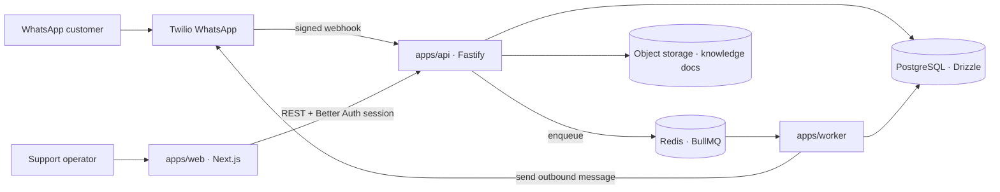

# Architecture

Sanitized system diagram. No real hostnames, IPs, or credentials appear here — see `README.md` for local setup and the `orbit` repository for deployment infrastructure.

## System context

## Component responsibilities

### `apps/api` (Fastify)

- Hosts Better Auth (sign-up, sign-in, invitations, membership).
- Validates Twilio webhook signatures and normalizes inbound WhatsApp messages (`modules/channel-messaging`).
- Owns the support-inbox read/write API: conversation listing with cursor pagination, conversation detail, operator replies (`modules/support-inbox`).
- Accepts knowledge-base document uploads via a scoped upload token and dispatches indexing jobs (`modules/knowledge-base`).
- Exposes `/health/live` and `/health/ready`, failing closed when Postgres or Redis is unreachable.

### `apps/worker`

- Consumes BullMQ jobs defined in `packages/jobs`: `process-inbound-message`, `send-outbound-message`, `index-knowledge-document`, plus transactional email jobs.
- Owns outbound delivery back to Twilio and knowledge-document indexing side effects.
- Exposes its own `/health/live` and `/health/ready`.

### `apps/web`

- Next.js operator interface: authentication flows, the `/inbox` and `/inbox/[conversationId]` support views, and `/settings` (members, knowledge base).

### Shared packages

- `packages/domain`: shared contracts and ULID generation, consumed by both API and worker.
- `packages/db`: Drizzle schema (`auth`, `support`, `knowledge`) and the Postgres client.
- `packages/jobs`: BullMQ job names, Zod schemas, and queue names shared between producer (API) and consumer (worker).
- `packages/config`, `packages/logger`, `packages/messaging`, `packages/object-storage`, `packages/email`: cross-cutting server concerns.
- `packages/ui`: shared UI primitives for `apps/web`.

## Data flow: inbound WhatsApp message

1. Twilio POSTs the inbound message to `apps/api`, which verifies the request signature against `PUBLIC_API_URL`.
2. The API normalizes the payload, persists the message, and enqueues `process-inbound-message` with a deterministic job ID keyed by `messageId` (idempotent redelivery).
3. `apps/worker` picks up the job, applies conversation-threading logic, and persists the resulting support-conversation state.
4. The operator sees the new/updated conversation in `apps/web` via the support-inbox API.
5. An operator reply enqueues `send-outbound-message`, which the worker delivers back through Twilio.

## Known boundaries

- Channel provisioning (`channel:provision:twilio`) is an internal CLI operation today; Meta Embedded Signup is not yet implemented.
- The knowledge-base module has no automated test coverage, unlike auth, channel-messaging, and support-inbox.
- This diagram describes the codebase's own architecture, not any specific deployment's current operational status.
